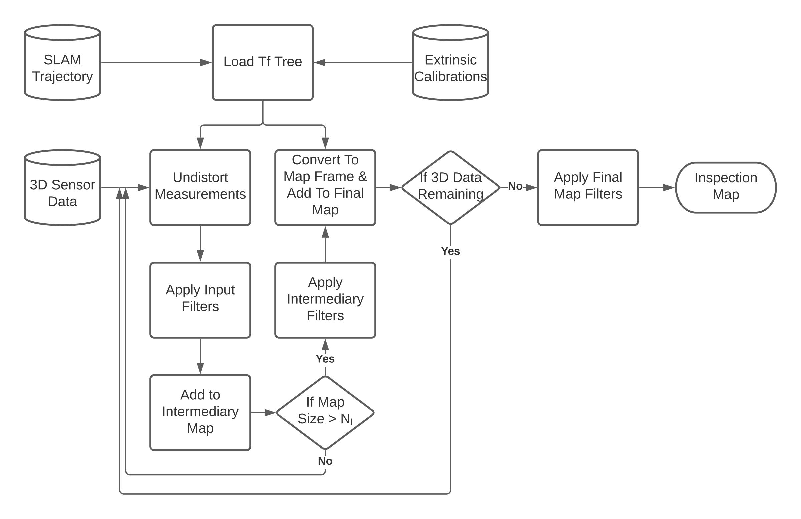
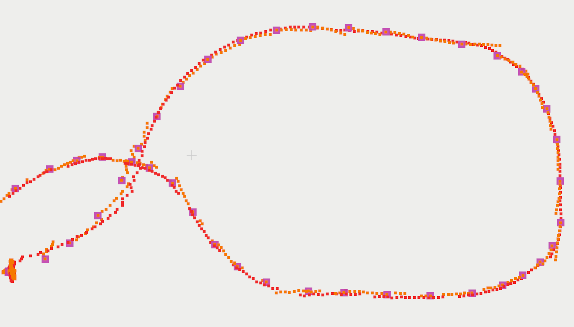
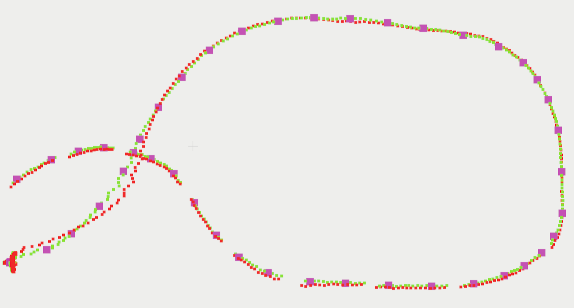
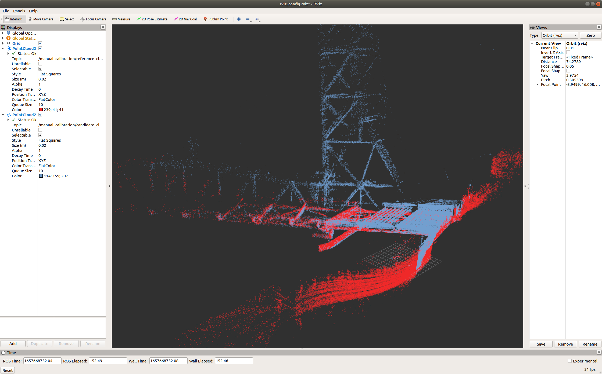
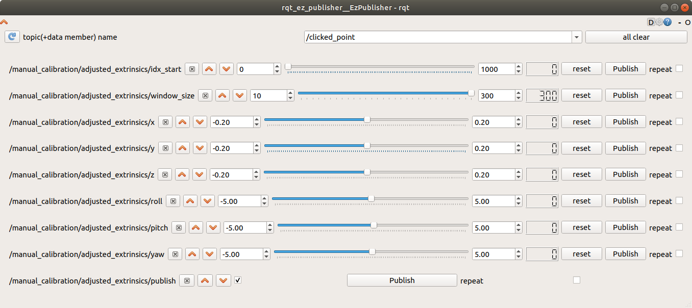

# 3d_map_builder

This repo contains the executables needed for building 3d maps from a SLAM trajectory and 3D sensor data, along with some useful data processing executables. This is intended to be used with libbeam's beam_mapping module (see install instructions for more details). This repo also contains some install tools to help install all necessary dependencies.

For more information, see our published research paper at: COMING SOON

If you use this tool for any research work, please cite the above paper.

## Dependencies

This repo only depends on our internal [libbeam](https://github.com/BEAMRobotics/libbeam) library. We currently have tested on Ubuntu18 with libbeam v1.1.0.

Libeam depends on the following:

* [ROS](https://www.ros.org/)
* [Catch2](https://github.com/catchorg/Catch2)
* [Eigen3](https://gitlab.com/libeigen/eigen/)
* [PCL 1.11.1 or greater](https://github.com/PointCloudLibrary/pcl)
* [gflags](https://github.com/gflags/gflags)
* [nlohmann json](https://github.com/nlohmann/json)
* [octomap](https://github.com/OctoMap/octomap)

For more information on libbeam and it's dependencies, see the [docs](https://github.com/BEAMRobotics/libbeam). Note that we do not need all modules of libbeam for 3d_map_builder, therefore we also don't need all dependencies (i.e., ceres and opencv4)

## Install

For ease of use, we provide an install script that has been tested on Ubuntu20. If you would like the option of not installing all required dependencies to your system (could avoid version conflicts), we'd recommend cloning to a new catkin workspace.

```
git clone https://github.com/nickcharron/3d_map_builder.git
cd 3d_map_builder
bash scripts/install.bash
```

This script clones libbeam and runs the libbeam install script with specific params (this only builds required libbeam modules). It then builds libbeam and 3d_map_builder. The libbeam install script install all libbeam dependencies. If you have any issues, we recommend you go through the install scripts and enter the commands manually.

IMPORTANT NOTE: octomap is a recent addition which is not integrated into the install scripts/docker. Please install using their instructions, or clone both the map builder and octomap in the same catkin workspace

### Docker

We also provide a docker container with the 3d_map_builder and libbeam compiled in a catkin workspace. This docker can be retrieved from: https://hub.docker.com/repository/docker/nickcharron/3d_map_builder

## Goal/Objectives:

* To have a method for building a map from 3D data (e.g., lidar, RGBD camera, sonar, etc) given a trajectory output from SLAM and extrinsic calibrations
* This allows the SLAM to be separated from the map building process. The
benefits of separating these are so that the user can tweak the mapping settings
(including amount of scans to use, filtering, loop closure, etc) without having to
rerun the SLAM. 
* This is not restricted to SLAM trajectories, but any sort of trajectory estimate such as: simulation with ground truth trajectories, or some motion capture system (e.g., Vicon System)

## Methodology:



This figure illustrates the methodology used to build maps. First, extrinsic calibrations between all required sensors are combined with the SLAM trajectory and loaded into a transformation tree (TF Tree). The SLAM trajectory should have poses that are expressed as a transform from some baselink frame to some world frame. The baselink frame is usually a frame associated with one of the sensors, and this may change based on the SLAM implementation. The extrinsics calibration must generate a tree that connects all 3D sensors to the baselink frame. 

Our Map Builder allows any number of filters to be applied to data at three different stages in the pipeline:
1. **input_filters**: filters are applied to the raw scans
2. **intermediate_filters**: individual scans are aggregated together into submaps of size equal to the "intermediary_map_size" parameter and then the filter is applied to that intermediate map. This is useful if you want to use noise removal filters that only work with a minimum point cloud density 
3. **output_filters**: these filters are applied once at the end of the mapping once the maps have been generated 

The following are the types of filters that have been implemented in libbeam/beam_filtering and can be called by the map builder:
* **DROR**: Dynamic Radius Outlier Removal filter, see https://ieeexplore.ieee.org/abstract/document/8575761
* **ROR**: Radius Outlier Removal filter, see PCL documentation
* **VOXEL**: voxel grid downsampling filter, this is a wrapper around the PCL voxel grid downsampling filter but ensures no interger overflow will occur. It does this by breaking up the pointcloud recursively into smaller clouds if it determines integer overflow will occur, then it applies the downsampling to each separate cloud and re-combines. 
* **CROPBOX**: This is our own custom implementation of the crop box filter which allows you to remove point inside or outside a user defined box, see https://github.com/BEAMRobotics/libbeam/blob/master/beam_filtering/include/beam_filtering/CropBox.h

## Executables:

### build_map

This is the main executable for building maps. For help on running the executable, run:

```
./path_to_build_dir/map_builder_build_map --help
```

All parameters can be configured in the input config json. For an example config file, see config/examples/EXAMPLE_CONFIG.json

**Inputs:**
* This code is built to work with a ROS bag and an optional pose file:
    * ROS Bag: This should contain all 3D data of type sensor_msgs/PointCloud2. You may have any number of topics that can be combined into a map or output as separate maps. This can also contain the trajectory as nav_msgs/Path or nav_msgs/Odometry, if a pose file is not provided.
    * Pose file: the pose file should contain all trajectory information. We have multiple pose file data formats including json, ply, pcd, and txt. For example formats, see: libbeam/beam_mapping/tests/test_data/PosesTests/. You can create these file formats using the bag_to_poses_file executable which convert topics from a bag to a pose file, or the poses_to_poses_file executable which converts a pose file to another pose file.

**Config Params:**
* **intermediary_map_size**: number of scans to aggregate into an intermediary map before applying intermediary filters
* **min_translation_m**: minimum translation in meters to take a new scan for the map
* **min_rotation_deg**: minimum rotation in degrees to take a new scan for the map (note that we use an or statement between this and min translation to determine if we keep a scan)
* **combine_sensor_data**: set to true if you want to create a map with all sensor data combined (if you have multiple sensors)
* **3d_sensor_data**: configuration for each 3D sensor
    * **topic**: topic the 3D data is published to
    * **frame**: frame id of this data which must correspond to one of the frames in the extrinsics
    * **use_cropbox**: set to true to apply a cropbox to this sensor data only
    * **remove_outside_points**: set to true to remove the outside points of the cropbox, false to remove inside points
    * **cropbox_min**: a vector [x, y, z] containing minimum coordinates of the cropbox
    * **cropbox_max**: a vector [x, y, z] containing maximum coordinates of the cropbox
* **input_filters**: list of filters to apply to input scans. These will be applied in order.
* **intermediary_filters**: list of filters to apply to the intermediary maps. These will be applied in order.
* **output_filters**: list of filters to apply to the final maps for each sensor. These will be applied in order.

### bag_to_poses_file

This tool can be used to convert trajectory measurements from a bag file to a pose file of any type (txt, json, ply, pcd). Topics can be of type :

* nav_msgs/Odometry: all messages will be combined into a pose file
* nav_msgs/Path: all poses from the **final message** will be combined into a pose file. We assume that the path messages are built incrementally and therefore the last Path message will contain all information. 

For more information on how to run the executable, run:

```
./path_to_build_dir/map_builder_bag_to_poses_file --help
```

### path_messages_to_pose_files

This tool can be used to output all path messages to their own pose files. This is useful to validate that your paths are being built incrementally

For more information on how to run the executable, run:

```
./path_to_build_dir/map_builder_path_messages_to_pose_files --help
```

### loop_closed_paths_to_poses

Often, SLAM runs a trajectory estimation at high rate (local mapping) and corrects poses at a slower rate running some loop closure technique. Often, the SLAM method doesn't output the high rate poses after correction. This tool is made for building a dense trajectory given a sparse loop closed (or corrected) poses and a dense uncorrected set of poses. We call the former the loop_closed_poses, and the latter the high_rate_poses. 
    
* loop_closed_poses: must be of type nav_msgs/Path. In this case, we take the last Path message as the final loop closed trajectory.
* high_rate_poses: must be of type nav_msgs/Path. In this case, we take all Path messages and combine then into one trajectory. For the case of duplicate poses (i.e., poses with the same timestamp), the latest estimates are kept.

For more information on how to run the executable, run:

```
./path_to_build_dir/map_builder_loop_closed_paths_to_poses --help
```

**Methodology:** This works by adding all poses into ordered maps, sorted by timestamp. We then iterate through each high rate pose, and when the timestamp align with, or exceeds a loop closed path, we calculate the correction T_WORLDCORRECTED_WORLDESTIMATED. Where world estimated, is the estimated world frame of the high rate poses, and world corrected is the estimated world frame of the loop closed poses. There are two options to apply these corrections:
1. we apply the same correction to all high rate poses between loop closed poses. This generally gives a discontinuous trajectory, but may be more precise because it does the least amount of interpolation
2. for each high rate pose, we interpolate a correction and apply that correction to the high rate pose. This provides a more continuous trajectory estimate, and this result should be similar to the result of included all high rate poses in the pose-graph optimization used during loop closure.

The figure below shows the difference between interpolating the corrections or not. In these figures, the magenta points are the sparse loop closed poses, the red points are the uncorrected high rate points, the orange points are the corrected high rate points without interpolating the corrections, and finally the green points are the corrected high rate poses with interpolated corrections. 






### fill_in_trajectory

This is the same thing as loop_closed_paths_to_poses, except it requires two poses files instead of directly extracting from a bag. This gives more versatility as you can extract the poses any way you want, using any other tools provided here. The above is only an option if you are using two path topics from a single bag which have the same frame IDs.

For more information on how to run the executable, run:

```
./path_to_build_dir/map_builder_fill_in_trajectory --help
```

### poses_to_poses_file

This tool can be used to convert a pose file to another pose file of any type (txt, json, ply, pcd). Additionally, there is the option to specify the frame in which poses are to be expressed. This is useful when comparing SLAM trajectories, as large offsets between differently assumed base_link frames can lead to incorrect comparisons.

For more information on how to run the executable, run:

```
./path_to_build_dir/map_builder_poses_to_poses_file --help
```

### manual_calibration

This tool can be used to manually adjust the extrinsic calibration of a candidate sensor (ex. multibeam sonar, vertically oriented lidar) with respect to a reference sensor (ex. horizontally oriented lidar). To begin, launch:

```
roslaunch map_builder manual_calibration.launch
```

and run the executable. For more information on how to run the executable, run:

```
./path_to_build_dir/manual_calibration.cpp --help
```

This will bring up a custom rviz window, where `/manual_calibration/reference_cloud` and `/manual_calibration/candidate_cloud` topics are subscribed to and visualized. The `reference_cloud` and `candidate_cloud` topics have constructions of the user specified reference sensor and candidate sensor, respectively, published over a window of size `window_size` from a starting index `start_index`. These manually adjustable parameters are available in the rqt_ez_publisher window that opens upon launch, with  `x,y,z,roll,pitch,yaw` parameters available for manual extrinsic calibration. When checking off `publish`, reference and candidate clouds are published as shown below. Note that for all topics shown in the rqt_ez_publisher window, `repeat` should remain unchecked.





Once the user is satisfied with the adjustment, `x,y,z,roll,pitch,yaw` can then be used to correct for the existing extrinsic calibration for the candidate sensor via hand calculations.

## Example

We provide an example bag file and configuration to help you get started. For simplicity, we will provide instructions for running using the docker image, however, if you are insalling locally, then follow the instructions above and ignore the docker parts from this section

### Download Data and Setup Docker

1. Download simulation dataset from [here](https://drive.google.com/file/d/1GferYDDFnFdmXObrdfwO2Mof7sdyI0Nf/view?usp=sharing)
2. Install docker if not already installed. See instructions [here](https://docs.docker.com/engine/install/ubuntu/), or use our install script in 3d_map_builder/scripts/install_docker.bash
3. docker pull nickcharron/3d_map_builder
4. start a docker container:

    ```
    docker run -it --rm -v /path_to/downloaded_data:/home/user/data -u user nickcharron/3d_map_builder
    ```

    Notes:  -it attaches to the docker
            --rm closes the container on exit
            -v mounts the downloaded data to the /home/user/data folder in the container
            -u switches to the user `user`. Note sudo password is `password` 

### Create Poses File

The bag has the trajectory saved as an odometry message with the topic name: /odometry/ground_truth. We need to take those messages and convert them to a pose file for the map builder

Within the docker container, run:

```
cd /home/user/catkin_ws
./build/3d_map_builder/map_builder_bag_to_poses_file -bag /home/user/data/sim_data.bag -output_path /home/user/data/ -topic /odometry/ground_truth -output_type JSON
```

If your data has the trajectory in the form of a path message, use the path_messages_to_pose_files executable. If you have a set of poses that are sparse but have been corrected with loop closed, and a set of dense poses that have not, you should use to loop_closed_paths_to_poses executable.

### Build Map

We are now ready to build the map. There are two files we will need to build the map, in addition to the pose file we just built:

1. Config file: The example config we included in 3d_map_builder/config/EXAMPLE_CONFIG.json is already setup to run on this dataset. When using your own data, make sure you go through this and understand all the parameters. See below for an explanation on the parameters.
2. Extrinsics file: we need to know the extrinsics to be able to transform all 3d data into the same reference frame. The extrinsics file we included in 3d_map_builder/config/EXAMPLE_EXTRINSICS.json has been setup to work on this dataset. You will need to create your own when using your own data.

After creating your extrinsics, and configuring your config, run the following to build the map:

```
cd /home/user/catkin_ws
./build/3d_map_builder/map_builder_build_map -config_file /home/user/catkin_ws/src/3d_map_builder/config/EXAMPLE_CONFIG.json -extrinsics /home/user/catkin_ws/src/3d_map_builder/config/EXAMPLE_EXTRINSICS.json -pose_file /home/user/data/poses.json -bag_file /home/user/data/sim_data.bag -output_directory /home/user/data/
```

That's it! Your maps will be output to the /home/user/data/ on your docker container, and should also appear the same location that you downloaded your bag file to on your computer.

Feel free to use this example to play around with the config such as filtering and map density.
